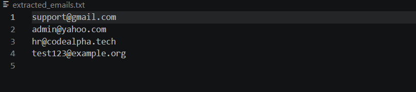
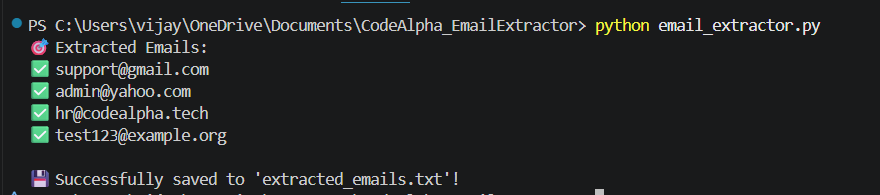

# 📧 Email Extractor

A simple Python automation script that extracts email addresses from a text file using Regular Expressions (`re`) and saves them into a separate file.

## 🚀 Features

* Reads text from an input file.
* Extracts all valid email addresses using Regular Expressions.
* Displays the extracted emails in the terminal.
* Saves the extracted emails to a new text file.
* Handles missing input files gracefully using exception handling.

## 🛠️ Technologies Used

* Python 3
* Regular Expressions (`re`)
* File Handling

## 📂 Project Structure

```
CodeAlpha_EmailExtractor/
│── email_extractor.py
│── input.txt
│── extracted_emails.txt
│── README.md
└── screenshots/
    ├── program_output.png
    └── extracted_emails.png
```

## ▶️ How to Run

1. Clone this repository.
2. Place your email data inside `input.txt`.
3. Open the project folder in the terminal.
4. Run the following command:

```
python email_extractor.py
```

5. The extracted email addresses will be saved automatically to `extracted_emails.txt`.

## 📸 Screenshots

### Program Output



### Extracted Emails



## 👨‍💻 Author

**VIJAYASARATHY B**

GitHub: https://github.com/Vijay-1420
